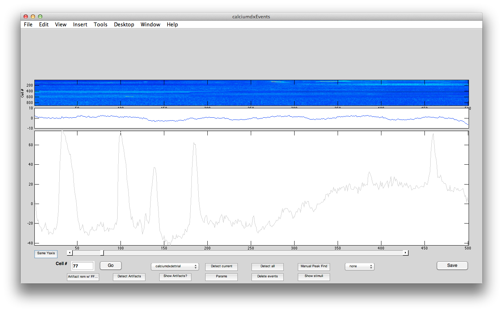
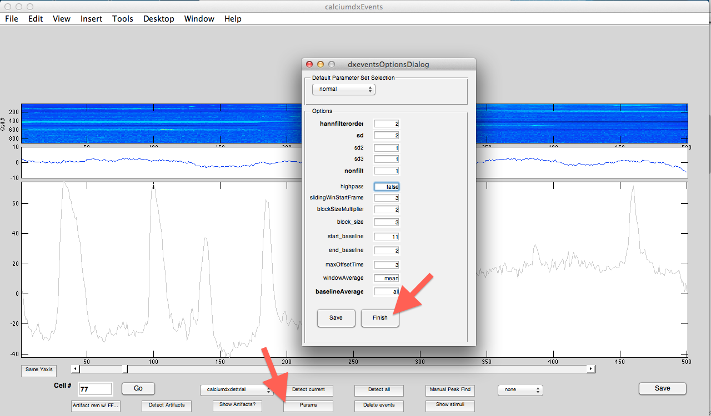
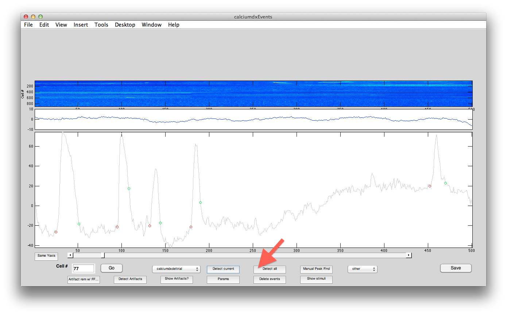

Date: 2013-07-02 10:18:19
Author: James B. Ackman

# CalciumDX #

A suite of functions for performing image processing, ROI detection, calcium trace reading, and event detection for calcium imaging movies in matlab.

Includes two core gui functions `calciumdx` and `calciumdxevents`

calciumdx
: A gui for image processing, ROI detection, and calcium trace reading

calciumdxevents
: A gui for data visualization and event detection

There are also a number of miscellaneous functions for data analysis, fetching of data tables, and plotting-- some of which are documented below.

# Requirements #

## Core dependencies ##
* matlab with the signal processing and image processing toolboxes

## Non-core dependencies ##
Several functions (mostly non-core gui) depend on the following freely available toolboxes:

* [DIPUM toolbox][dipumToolbox] [#Gonzalez:2009]. Most of the core functionality does not depend on this, except for an fft notch artifact filter and some spatial pattern metrics for image similarity/distance measure calculations.
* [piotrImageVideoProcessingToolbox][piotrToolbox]. A couple non-core functions make use of xcorrn from this toolbox.
* [sigTOOL][sigtool]. Used with the stimulus movies workflow. This program is useful if going to use simultaneously acquired electrophysiology, stimulation data stored in a a data format readable by sigtool, such as CED Spike2 .smr files. This toolbox will read those files and output a .kcl matlab data structure file format.

# Installation #

1. Clone CalciumDX from GitHub into your *MATLAB* user folder.
2. Add CalciumDX/CalciumDX to your [matlab path][matlabSearchPath]
3. Add CalciumDX/CalciumDXevents to your matlab path 
4. *Optional:* Install the non-core dependency toolboxes
	* download from the respective sites listed above
	* move the toolboxes into your matlab user home folder
	* add their folders and subfolders to your matlab path.

## Updates ##

Make sure you have the GitHub application or git installed on your local machine to keep your local copy in sync with this remote GitHub repository. A few options:

* can use the *Sync* button if you haven't made changes to any files or added anything to the CalciumDX subdirectories. [Sync is equivalent to][SyncPushPull] `git pull --rebase`
* can use *Pull* from the *Repository* dropdown menu if using GitHub for Mac OSX
* can use the git command line client by typing `git pull` on either Windows or Mac OSX.
	* tip: if you have uncommitted changes on your local CalciumDX repository (files you've accidentally added or changed) then you can move those files or just run `git stash` from command line before doing `git pull`. This will save and hide the changes and those files (which you can always retrieve later if needed using git).

------------------------------------------------------------

#Image processing, ROI detection, and calcium trace reading

These are the instructions on how to use `calciumdx.m` to perform the initial reading in of your image time-series, make ROIs, and read raw fluorescence trace data.

1. At the matlab command prompt type `calciumdx`.
1. Click 'Open'. For CCD recording select your .tif file. For 2P, select first .tif image in your series. Wait for image series to open, may take up to a minute to complete.
2. Select to average frames together for base image. Default is to do all frames. But if there is a lot of xy or z movement artifacts (like for 2P imaging movies), you will want to instead do at least 5-10 consecutive frames that are stable (no xyz movements) and are largely non-active (not much activity). May need to open series as virtual stack in imageJ to know which frame range to select
3. Select the anterior medial reference point in the image. Try to select the medial point just anterior to your dye labeled hemispheres (usually around lambda for superior colliculus imaging for example). This value will be stored in `region.orientation.value` in your data file and used later when matching normalized spatial measurements (ROI locations, directions) between hemispheres when fetching data.
3. Observe the spatial resolution and temporal resolution values to make sure they are correct. If the imaging was saved with an OME tiff standard (like for Prairie 2P tiffs) these values should be automatically fetched and populated in the fields. For CCD recording you must manually enter the values (e.g. 2.27275 um/px for 5x obj, or 4.5455 um/px for 2.5x obj and 0.2 sec/frame).
4. You can now adjust brightness and contrast so you can see edges of your labeled region in your image.
5. Click 'Add' button to add each region to the image using polygon outline. (i.e outline each labeled hemisphere or brain region independently). Then 'left click' to add points to surround the structure, when complete 'right click' to complete outline. Repeat 'Add' button for each structure (i.e. 1 for ea hemisphere).
6. Click 'Next'
7. Enter names for each region ('SC.R', 'SC.L', 'V1.R' or 'VZ', 'SVZ', 'CP' etc). Region 1 will be everything outside your labeled regions, this could be simply named 'craniotomy'.
8. Click 'Next'
9. Options:
	* *For grid based roi analysis:* Select 'calciumdxIF_none_' from drop down menu and click 'Filter' 
	* *For cell based roi analysis:* Select 'calciumdxIF_Localize' and click 'Filter' for automatic cell detection.
10. Options: 
	* *For grid based roi analysis:* Click the bottom 'Next' to continue on 
	* *For cell based roi analysis:* Use the parameters to perform automatic cell detection or manual ROI drawing inside labeled regions TODO: document this.
11. Options: 
	* *For grid based roi analysis:* When asked to draw rectangular grid, select 'Yes'.
		* when asked to draw rectanglar ROI grid for the 1st region (probably the 'craniotomy' background region), select 'No'.
		* When asked to draw rectangular ROI grid for each labeled region, select 'Yes'.
		* Enter a ROI size. Can use 10x10px for CCD recordings. Can leave at the default value for 2Pphoton based recordings. Close the resulting figure image windows.
	* *For cell based roi analysis:* When asked to draw rectangular grid, select 'No'.
12. On the main application window select 'ReadTracesPrTIFF' and click 'Next>>'
13. Click 'Finish' and save the resulting .mat file.

#Calcium event detection

For this we will use `calciumdxevents.m`

1. Start `calciumdxevents`
	* If you've just performed calcium trace reading using `calciumdx`, then `calciumdxevents` should automatically open with your new data.
	* Otherwise at the matlab command prompt type `calciumdxevents` and open your *region* based .mat file saved using calciumdx.
	* 	
2. *Optional:* Click 'Artifact rem w/FFT' button.
3. *Optional:* Click 'Detect Artifacts' button.
4. Click 'Params' button to edit the default parameters in an Options Dialog box.
	* *Hint1: The bold faced parameters are the best ones to try editing for your own detection requirements.*
	* *Hint2: Clicking 'Save' will save your edited default parameters as 'custom1' in your calciumdxprefs.mat file in your matlab home folder and will be automatically reloaded next time calciumdxevents is run.*
	* 
5. Click 'Finish' in the Options Dialog box to export these parameters for event detection in next step.
6. Click 'Detect current' to detect events on the current cell no. Use `calciumdxdettrial.m`. Can repeat on several cells while assessing/changing detection parameters.
7. Click 'Detect all' button to automatically detect calcium events for all cells.  Use `calciumdxdettrial.m`.
	* 
8. Click 'Save' to save file.
9. *Optional:* Click 'Manual Peaks'. Follow instructions using the brush tool and export variable either called 'waveframes' or 'artifactframes'. This is more important for 2P recorded movies where movement artifacts may be more evident, or movies with low frequency of real activity where peaks of artifacts could be picked up as waves in downstream analysis. If the detected transients are largely true-positive, then just click 'Continue' without brushing and exporting any variables. This will just accept all frames as possible frames containing real activity. Then the next couple scripts will be used for detecting waves among the events.
10. Click 'Save' to save file again.

#Calcium wave detection

The commands in this section only need to be used if you wish to automatically detect and mark propagating calcium waves (e.g. Ackman, et al. 2012). 

Copy each of the following lines in sequence and paste to the matlab command prompt:

	region = calciumdxDetectWaves(region);
	region = calciumdxDetectWavesRefine(region);
	region = getWaveCentroids(region);
	region = getWaveSizeDistance(region);
	region = getActiveFraction(region);
	region = getWaveSpeeds(region);
	region = getWaveDirections(region);
	data = batchFetchWaveProp({filename},region); 
	[fighandle, axeshandles] = myMakeMultiWaveSummaryPlot(region,data);
	
Or do the above commands in a one-liner:

	region = getWaveCentroids(region); region = getWaveSizeDistance(region); region = getActiveFraction(region); region = getWaveSpeeds(region); region = getWaveDirections(region); data = batchFetchWaveProp({filename},region); [fighandle, axeshandles] = myMakeMultiWaveSummaryPlot(region,data);

Save .mat file and the resulting multiwaveplots:

	save(fnm,'region')
	fname2 = [fnm(1:end-4) 'multiwaveplotRhemi' '.eps']; printfig('epsc',fname2)
	fname2 = [fnm(1:end-4) 'multiwaveplotLhemi' '.eps']; printfig('epsc',fname2)

## Optional -- Visually correct wave directions ##

	i = 6; locationIndex = 2;
	region.wavedata{locationIndex}.waveprops.wavedirection.the
	ta_radians(i) =
	region.wavedata{locationIndex}.waveprops.wavedirection.the
	ta_radians(i) + (pi)  %fix individual wave angles
	save(fnm,'region')
	data = batchFetchWaveProp({filename},region);
	myMakeMultiWaveSummaryPlot(region,data); %copy output table to excel or txt file

Save .mat file and the resulting multiwaveplots:

	save(fnm,'region')
	fname2 = [fnm(1:end-4) 'multiwaveplotRhemi' '.eps']; printfig('epsc',fname2)
	fname2 = [fnm(1:end-4) 'multiwaveplotLhemi' '.eps']; printfig('epsc',fname2)

# Summary Plots and cell traces

## Rasterplots ##

Plot a default histogram with raw event data:

	myPlotRasterHist([],region);

Same but also automatically save the figure if `fnm` is defined in workspace:

	myPlotRasterHist([],region);
	fname2 = [fnm(1:end-4) 'rastHist' '.eps']; 
	printfig('epsc',fname2)

Plot a smoothened histogram if you have wave data:

	myPlotRasterHist([],region,[],[],[],'true','true'); fname2 = [fnm(1:end-4) 'rastHistSmooth' '.eps']; printfig('epsc',fname2)

Plot a more complex report with raster, hist, example, traces, measurements:
 
	calciumdxprintout

Plot single a trace from a single ROI:

	myPrintTrace(fnm,num,nt,region)  %can be used in conjunction with calciumdxevents opened to view different ROI traces (for automatically specifying cell 'num')

Same but plot a specific segment of time, e.g. only between frame 1 to frame 120:

	myPrintTrace(fnm,num,nt,region,1,120)

##Wave direction plot

Print out and save wave direction plots with following command sequence (copy and paste to command line):

	locationIndex=3;  %change this no. to the hemisphere you want to plot 
	theta=region.wavedata{locationIndex}.waveprops.wavedirection.theta_radians(~isnan(region.wavedata{locationIndex}.waveprops.wavedirection.theta_radians));
	rho=region.wavedata{locationIndex}.waveprops.wavedistance_px(~isnan(region.wavedata{locationIndex}.waveprops.wavedirection.theta_radians));
	rho = rho .* region.spaceres;
	[x,y] = pol2cart(theta,rho);
	figure; compass(x,y)
	title([region.name(locationIndex) ' all waves, wavedistance in um'])
	fname2 = [fnm(1:end-4) 'wavedirLhemi' '.eps']; printfig('epsc',fname2)

# Make a calcium event based dataset 

For passing the resulting dataframe/database to statistical analysis environments such as R. Automatically saves a space delimited .txt file with all data.

	batchFetchCalciumEventProps({filename},region);

# Stimulus movies workflow #

This workflow is optional. Can be used to make stimulus triggers (e.g. visual, tactile stim, etc).

## Make stimulus triggers ##

* sigTOOL.m  %eeg, electrophysiology matlab program from Kings College London. Opens CED Spike2 .smr files
* File --> Import --> Batch Import .smr files into .kcl files
* calciumdx and calciumdxevents
* mySTopen.m
* [sig_idx1 times] = myFrameTriggerDetect(1,2)
		  [sig_idx1 times] =
		  myFrameTriggerDetect(fhandle,channelToFilter)
* [stimulusParams] = getStimParams(1,3,times,1)
		  need batch script to add multiple
		  channelsToFilter, and reformat structure to hold
		  the multiple event channels, and add event
		  description (asynch flash to left eye, right eye,
		  etc)
* [stimuli] = getStimParams(1,[3 4],times,1)
* alternate for missing frame trig movies (110613
	  movies)
		  load times
		  [stimuli] = getStimParams(1,[3 4], times,1) %for
		  fig window 1 and 1s dur
* add event description with excel file open
* region.stimuli = stimuli;
* Show stimuli in calciumdxevents
* save file with calciumdxevents.  or save(fnm,'region')
* myPlotRasterHist([],region,region.stimuli); fname2 =
	  [fnm(1:end-4) 'rastHist' '.eps'];
	  printfig('epsc',fname2)

	  
##  Make waves into stimulus triggers ##

For doing peri-stimulus time histogram analysis, as in `batchFetchStimResponseProps.m`

%This adds a vector of frame indices as stimulus markers to 'region.stimuli' with a text descriptor:  

	region = makeStimParams(region,region.wavedata{2}.waveonsets,'waveonsets.V1.L')  

**'stimulus_times'** is the most important parameter, as this is the only one used downstream in `batchFetchStimResponseProps.m`.  **'frame_indices' or 'frame_times'** may just be used for plotting purposes of the stimuli (plotting duration of pulses) like in `myPlotRasterHist.m`. For example they are stored: `region.stimuli{i}.stimulusParams{j}.stimulus_times`

%This next function automatically adds wave onsets and offsets as region.stimuli.  This function calls makeStimParams.m:  

	batchmakeStimParamsWaveonsets(filelist);  

## Perform peri-stimulus time histogram analysis ##

* [results,responseArray,responseFreq] = myMakeMultiPETHplot(region);
* region.userdata.results=results;
	  region.userdata.responseArray=responseArray;
	  region.userdata.responseFreq=responseFreq;
* save(fnm,'region')
* fname2 = [fnm(1:end-4)
	  'multiPETH-responseSC-R_-300-3000ms' '.eps'];
	  printfig('epsc',fname2)
* fname2 = [fnm(1:end-4)
	  'avgWaveform-responseSC-R_-300-3000ms' '.eps'];
	  printfig('epsc',fname2)
* fname2 = [fnm(1:end-4)
	  'responseFreqContourPlot-LReyeStim_-300-3000ms' '.eps'];
	  printfig('epsc',fname2)
* data=batchFetchStimResponseProps({filename},region,[],[-20
	  00 5000],[]);  %this is all you need, it is a wrapper for myMakeMultiPETHplot with automatic writing of data table file

[#Gonzalez:2009]: Digital Image Processing Using MATLAB, 2nd edition, by R.C. Gonzalez, R.E. Woods, and S.L. Eddins, Gatesmark Publishing, 2009.

[SyncPushPull]: http://mac.github.com/help.html#faq-sync-push-pull

[matlabSearchPath]: http://www.mathworks.com/help/matlab/matlab_env/what-is-the-matlab-search-path.html

[piotrToolbox]: http://vision.ucsd.edu/~pdollar/toolbox/doc/

[dipumToolbox]: http://www.imageprocessingplace.com/DIPUM_Toolbox_2/DIPUM_Toolbox_2.htm

[sigtool]: http://sourceforge.net/projects/sigtool/
